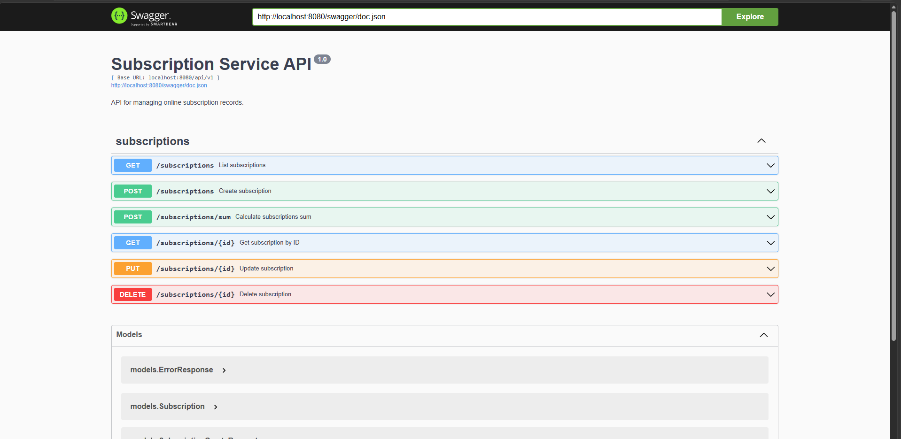

# Subscription Aggregator API

[](https://github.com/t0fox/subscription-aggregator-api/actions/workflows/ci.yml)

REST API in Go for storing user online subscriptions and calculating their total cost for a selected period.


## Overview

The service implements CRUDL operations for subscription records and provides an endpoint for calculating the total subscription cost for a selected period.

Each subscription contains:

- service name
- monthly price in rubles
- user ID in UUID format
- subscription start date in `MM-YYYY`
- optional subscription end date in `MM-YYYY`

## API Documentation

Interactive Swagger UI is available at `/swagger/index.html` when the service is running.



## Features

- Create, list, get, update, and delete subscriptions
- Calculate total subscription cost for a selected period
- Filter total cost by `user_id` and `service_name`
- PostgreSQL storage
- SQL migrations for database initialization
- Environment-based configuration via `.env`
- HTTP request logging
- Swagger documentation
- Docker Compose startup

## Stack

- Go 1.22
- Gin
- pgx
- PostgreSQL 15
- Docker / Docker Compose
- Swagger

## Project Structure

```text
.
|-- .github/workflows
|-- cmd/server
|-- docs
|-- internal/config
|-- internal/handlers
|-- internal/middleware
|-- internal/models
|-- internal/repository
|-- internal/service
|-- migrations
|-- pkg/database
|-- docker-compose.yml
|-- Dockerfile
`-- README.md
```

## Quick Start

```bash
git clone https://github.com/t0fox/subscription-aggregator-api.git
cd subscription-aggregator-api
docker compose up --build
```

API base URL:

```text
http://localhost:8080/api/v1
```

Swagger UI:

```text
http://localhost:8080/swagger/index.html
```

Swagger JSON:

```text
http://localhost:8080/swagger/doc.json
```

## Environment Variables

```env
DB_HOST=localhost
DB_PORT=5432
DB_USER=subscription_user
DB_PASSWORD=subscription_password
DB_NAME=subscription_db
SERVER_PORT=8080
LOG_LEVEL=info
```

## API Endpoints

| Method | Path | Description |
| --- | --- | --- |
| `POST` | `/api/v1/subscriptions` | Create subscription |
| `GET` | `/api/v1/subscriptions` | List subscriptions |
| `GET` | `/api/v1/subscriptions/{id}` | Get subscription by ID |
| `PUT` | `/api/v1/subscriptions/{id}` | Update subscription |
| `DELETE` | `/api/v1/subscriptions/{id}` | Delete subscription |
| `POST` | `/api/v1/subscriptions/sum` | Calculate total subscription cost |

## Example Create Request

```bash
curl -X POST http://localhost:8080/api/v1/subscriptions \
  -H "Content-Type: application/json" \
  -d '{
    "service_name": "Yandex Plus",
    "price": 400,
    "user_id": "60601fee-2bf1-4721-ae6f-7636e79a0cba",
    "start_date": "07-2025"
  }'
```

## Example Sum Request

```bash
curl -X POST http://localhost:8080/api/v1/subscriptions/sum \
  -H "Content-Type: application/json" \
  -d '{
    "user_id": "60601fee-2bf1-4721-ae6f-7636e79a0cba",
    "service_name": "Yandex Plus",
    "start_date": "07-2025",
    "end_date": "12-2025"
  }'
```

Example response for a 400 rub/month subscription active from `07-2025` through `12-2025`:

```json
{
  "total": 2400
}
```

## Testing

Run the full test suite locally:

```bash
go test ./...
```

Run the same race and coverage check used by CI:

```bash
go test -race -cover ./...
```

Check formatting and vetting before review:

```bash
gofmt -l .
go vet ./...
```

## CI/CD

GitHub Actions runs on every push and pull request to `main`.

The CI pipeline checks:

- `gofmt`
- `go vet ./...`
- `go build ./...`
- `go test -race -cover ./...`
- `golangci-lint`
- Docker image build

PostgreSQL 15 is provided as a CI service with a healthcheck for jobs that need database configuration.
